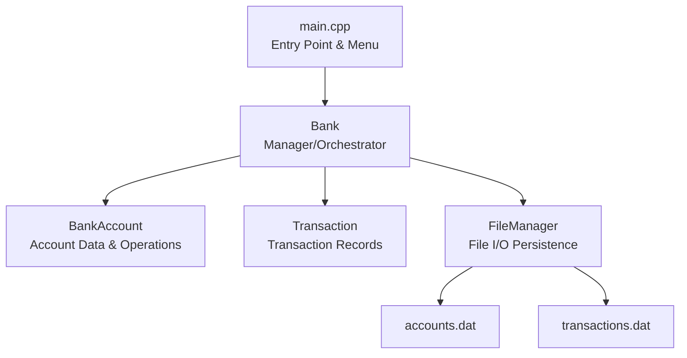

# Banking System — Project Walkthrough

## Task
Pinnacle Labs internship task: **Develop a C++-based banking system** with user accounts, balance management, deposits, withdrawals, and transaction history.

## Architecture



## Files Created

| File | Purpose | Lines |
|------|---------|-------|
| [main.cpp](file:///c:/Users/Priyam%20Prakash/OneDrive/Desktop/banking%20System/main.cpp) | Entry point, ASCII banner, interactive menu | ~100 |
| [Bank.h](file:///c:/Users/Priyam%20Prakash/OneDrive/Desktop/banking%20System/Bank.h) / [Bank.cpp](file:///c:/Users/Priyam%20Prakash/OneDrive/Desktop/banking%20System/Bank.cpp) | Central manager — all banking operations | ~370 |
| [BankAccount.h](file:///c:/Users/Priyam%20Prakash/OneDrive/Desktop/banking%20System/BankAccount.h) / [BankAccount.cpp](file:///c:/Users/Priyam%20Prakash/OneDrive/Desktop/banking%20System/BankAccount.cpp) | Account class with PIN, deposit, withdraw | ~130 |
| [Transaction.h](file:///c:/Users/Priyam%20Prakash/OneDrive/Desktop/banking%20System/Transaction.h) / [Transaction.cpp](file:///c:/Users/Priyam%20Prakash/OneDrive/Desktop/banking%20System/Transaction.cpp) | Transaction records with timestamps | ~100 |
| [FileManager.h](file:///c:/Users/Priyam%20Prakash/OneDrive/Desktop/banking%20System/FileManager.h) / [FileManager.cpp](file:///c:/Users/Priyam%20Prakash/OneDrive/Desktop/banking%20System/FileManager.cpp) | Persistent file-based storage | ~75 |
| [README.md](file:///c:/Users/Priyam%20Prakash/OneDrive/Desktop/banking%20System/README.md) | Documentation & build instructions | — |

## Features Implemented

| # | Feature | Description |
|---|---------|-------------|
| 1 | **Create Account** | Full name, 4-digit PIN (with confirmation), minimum Rs. 500 initial deposit |
| 2 | **View Account Details** | PIN-authenticated account info display |
| 3 | **Deposit Funds** | Add money with validation |
| 4 | **Withdraw Funds** | PIN-authenticated, insufficient balance protection |
| 5 | **Fund Transfer** | Between two accounts, dual transaction logging |
| 6 | **Check Balance** | PIN-secured balance enquiry |
| 7 | **Transaction History** | Full audit trail per account |
| 8 | **List All Accounts** | Tabular view of all registered accounts |
| 9 | **Close Account** | Confirmation prompt, final balance return |

## How to Run

```bash
# Already compiled — just run:
cd "c:\Users\Priyam Prakash\OneDrive\Desktop\banking System"
.\banking_system.exe

# Or recompile if needed:
g++ -std=c++11 -o banking_system.exe main.cpp BankAccount.cpp Bank.cpp Transaction.cpp FileManager.cpp
```

## Build Verification
- ✅ Compiled with `g++ 6.3.0` — **zero errors, zero warnings**
- ✅ Executable `banking_system.exe` (217 KB) generated successfully
